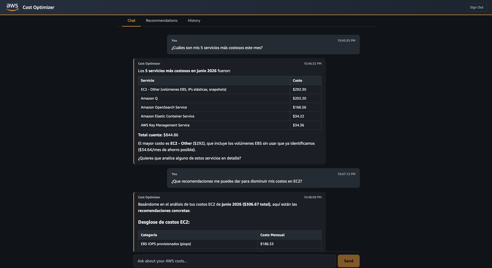
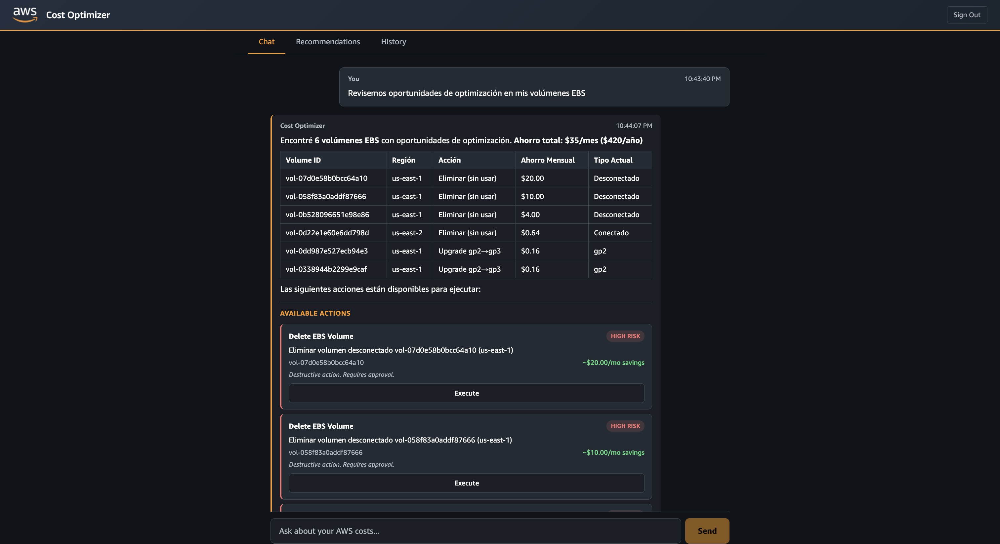
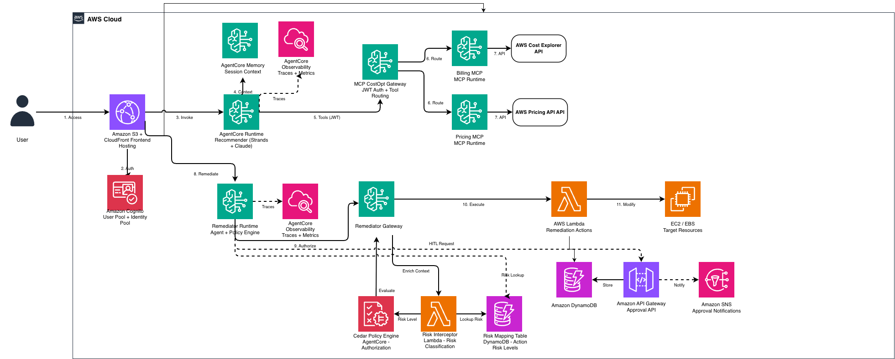

# AgentCore Cost Optimizer

> This is sample code for demonstration purposes, not intended for production use without review and modification.

[](https://opensource.org/licenses/MIT-0)
[](https://aws.amazon.com/bedrock/)
[](https://www.finops.org/)

A conversational FinOps agent built on Amazon Bedrock AgentCore that analyzes AWS spending, detects underutilized resources, and executes governed remediations with human-in-the-loop approval workflows.

| Cost Analysis & Recommendations | One-Click Remediation Actions |
|:---:|:---:|
|  |  |

## Features

- **Conversational Cost Analysis** — Query AWS billing data using natural language
- **Resource Optimization** — Detect underutilized EC2 instances, idle EBS volumes, and upgrade opportunities
- **One-Click Remediation** — Execute actions (resize, stop, terminate, delete, migrate storage) directly from the chat
- **Cedar Policy Authorization** — Role-based access control via AgentCore Policy Engine (Analyst/Engineer/Manager)
- **Human-in-the-Loop** — High-risk actions require email approval before execution
- **Audit Trail** — All actions logged to DynamoDB with user identity, role, and outcome
- **Multi-Session Memory** — Conversation context persists across sessions

## Architecture



The system uses five AgentCore pillars: **Runtime** (Strands agents + Claude Sonnet 4.5), **Gateway** (MCP protocol aggregation), **Memory** (conversation persistence), **Identity** (Cognito + JWT), and **Policy** (Cedar authorization).

For detailed architecture documentation, see [docs/ARCHITECTURE.md](docs/ARCHITECTURE.md).

## Prerequisites

- AWS Account with Administrator access
- AWS CLI configured (`aws configure`)
- AWS CDK 2.180+ (`npm install -g aws-cdk`)
- Node.js 20.x+
- Python 3.13+
- Bedrock Model Access: Claude Sonnet 4.5 enabled ([Model Access](https://docs.aws.amazon.com/bedrock/latest/userguide/model-access.html))

## Quick Start

```bash
# Clone and install
git clone https://github.com/aws-samples/agentcore-cost-optimizer.git
cd agentcore-cost-optimizer
cd cdk && npm ci && cd ..
cd frontend && npm ci && cd ..

# Bootstrap CDK (first time only)
cd cdk && npx cdk bootstrap

# Deploy all stacks (~15-20 minutes)
npx cdk deploy --all --require-approval never
```

## Post-Deployment Setup

After deployment, CDK outputs the resource IDs needed below.

### 1. Create a User

```bash
aws cognito-idp admin-create-user \
  --user-pool-id <UserPoolId> \
  --username your-email@example.com \
  --user-attributes Name=email,Value=your-email@example.com Name=email_verified,Value=true \
  --temporary-password TempPassword123! \
  --message-action SUPPRESS
```

### 2. Assign User to a Cognito Group (Required)

Users must be in a group for remediation actions to work. Without a group, the Cedar PolicyEngine blocks all tool discovery.

| Group | Permissions |
|-------|-------------|
| `CostOpt-Analyst` | Read-only (cost queries only) |
| `CostOpt-Engineer` | Low and medium risk actions |
| `CostOpt-Manager` | All actions including high-risk |

```bash
aws cognito-idp admin-add-user-to-group \
  --user-pool-id <UserPoolId> \
  --username your-email@example.com \
  --group-name CostOpt-Manager
```

### 3. Subscribe Approvers to SNS (Required for HITL)

High-risk actions send approval requests via email. Approvers are defined by their SNS subscription, not by their Cognito role.

```bash
aws sns subscribe \
  --topic-arn <ApprovalSNSTopic> \
  --protocol email \
  --notification-endpoint approver@example.com \
  --region us-east-1
```

The approver must click the confirmation link in the email AWS sends.

### 4. Add CloudFront URL to Cognito

After deployment, add your CloudFront URL to the Cognito App Client callback/logout URLs (via AWS Console > Cognito > User Pool > App Client > Hosted UI settings).

## Usage

Navigate to the CloudFront URL from CDK outputs, log in, and start asking questions:

- "What are my top 5 AWS costs this month?"
- "Are there any unattached EBS volumes?"
- "Show me underutilized EC2 instances"

When the agent finds optimizations, action buttons appear below the response. Click to execute directly or trigger approval workflow for high-risk actions.

## Project Structure

```
agentcore-cost-optimizer/
├── src/
│   ├── recommender/        # Recommender Agent (Strands + Claude)
│   └── remediator/         # Remediator Agent (executes actions)
├── frontend/               # React + TypeScript + Vite
├── lambda/                 # Lambda functions (approval, audit, remediation)
├── cdk/                    # AWS CDK infrastructure
├── codebuild-scripts/      # Docker image build scripts
├── docs/                   # Architecture docs, Cedar policies
└── tests/                  # Unit tests
```

## Deployment Stacks

| Stack | Purpose |
|-------|---------|
| CostOptAuthStack | Cognito User Pool + Identity Pool |
| CostOptImageStack | ECR repos + CodeBuild projects |
| CostOptMCPRuntimeStack | Billing and Pricing MCP server runtimes |
| CostOptGatewayStack | MCP Gateway (JWT-authenticated) |
| CostOptAgentRuntimeStack | Recommender Agent Runtime |
| CostOptRemediatorStack | Remediator Agent Runtime + remediation Lambdas |
| CostOptRemediatorGatewayStack | Remediator Gateway + Policy Engine + Cedar |
| CostOptApprovalStack | HITL approval workflow (API GW + SNS + DynamoDB) |

## Cleanup

```bash
cd cdk
npx cdk destroy --all
```

## Security

See [CONTRIBUTING](CONTRIBUTING.md#security-issue-notifications) for more information.

## License

This library is licensed under the MIT-0 License. See the [LICENSE](LICENSE) file.
