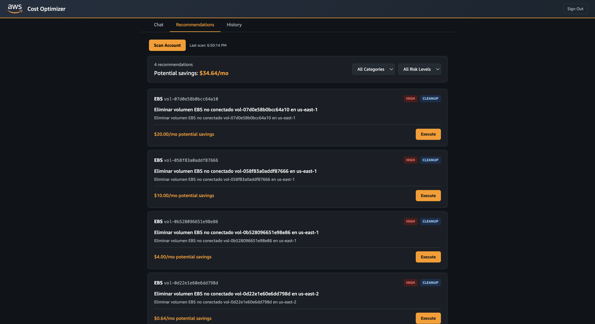
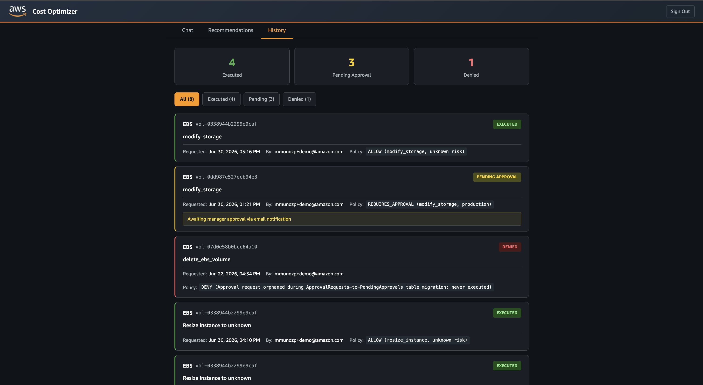

# Architecture

## Overview

AgentCore Cost Optimizer is built on the five pillars of Amazon Bedrock AgentCore:

## AgentCore Runtimes (3)

### Recommender Agent (`costopt_runtime`)

The primary conversational agent using Strands Agent SDK + Claude Sonnet 4.5:

- Receives user queries via authenticated frontend
- Calls billing/pricing tools via MCP Gateway
- Generates cost analysis and optimization recommendations
- Produces REMEDIATION_OPTIONS blocks for one-click execution
- Discovers available remediation actions dynamically from Remediator Gateway

### Remediator Agent (`costopt_remediator`)

Executes approved remediation actions:

- Receives action requests from frontend (action_type, resource_id, parameters, risk_level)
- Evaluates risk: low/medium execute immediately, high triggers HITL approval
- Invokes remediation Lambda functions
- Logs all actions to DynamoDB audit trail (user_id, user_role, decision, result)
- Creates SNS approval requests for high-risk actions

### MCP Server Runtimes (Billing + Pricing)

Containerized awslabs MCP servers running as AgentCore MCP Runtimes:

- `billing-mcp-runtime`: AWS Cost Explorer, budgets, savings plans, optimization hub
- `pricing-mcp-runtime`: AWS Pricing API lookups

## AgentCore Gateways (2)

### costopt-gateway (MCP Gateway)

Aggregates Billing + Pricing MCP runtimes under a single endpoint:

- Protocol: MCP (Streamable HTTP)
- Targets: McpServer endpoints (pointing to MCP runtime URLs)
- Auth inbound: JWT (Cognito) for user identity
- Auth outbound: OAuth (M2M) to authenticate to MCP runtimes
- Exposes ~30 tools to the Recommender Agent

### costopt-remediator-gw (Remediator Gateway)

Provides governed access to remediation actions:

- Protocol: MCP
- Targets: 7 Lambda functions (resize, stop, terminate, modify_storage, add_tag, delete_snapshot, delete_ebs_volume)
- Auth: JWT (Cognito)
- PolicyEngine: Cedar in ENFORCE mode
- Risk Interceptor: Lambda that enriches requests with risk classification from DynamoDB

## Cedar Policy Authorization

The Remediator Gateway uses Cedar policies for RBAC:

- `permit_low_risk`: Allows resize, modify_storage, add_tag for Engineer/Manager groups
- `permit_medium_risk`: Allows stop_instance, delete_snapshot for Engineer/Manager groups
- `permit_high_risk`: Allows terminate_instance, delete_ebs_volume for Manager group only

`tools/list` responses are filtered by Cedar — users only see tools they are permitted to call.

## HITL Approval Flow

1. User clicks high-risk action button in frontend
2. Frontend sends request to Remediator Runtime with risk_level="high"
3. Remediator creates approval record in PendingApprovals table (24h TTL)
4. SNS notification sent to subscribed approvers with approve/reject URLs
5. Approver clicks URL → API Gateway → approval_handler Lambda
6. If approved: Lambda executes the remediation action
7. If expired (24h): EventBridge rule triggers approval_timeout Lambda
8. Audit log updated in all cases (approved, denied, expired)

## Frontend

React + TypeScript + Vite, hosted on S3 + CloudFront:

| Recommendation Agent | Remediation Actions | Recommendations Panel | Execution History |
|:---:|:---:|:---:|:---:|
|  |  |  |  |

- Cognito authentication via AWS Amplify
- Chat interface with markdown rendering and action buttons
- Recommendations dashboard (auto-scan via agent)
- Execution history from DynamoDB audit log
- SigV4-signed requests to AgentCore Runtime APIs

## Data Stores

- **RemediationAuditLog** (DynamoDB): Permanent audit trail. PK: action_id, SK: timestamp
- **PendingApprovals** (DynamoDB): Temporary approval queue. 24h TTL, deleted after resolution
- **AgentCore Memory**: Conversation history per session (30-day expiration)
- **CostOptRiskMappings** (DynamoDB): Risk classification rules per action/resource type
