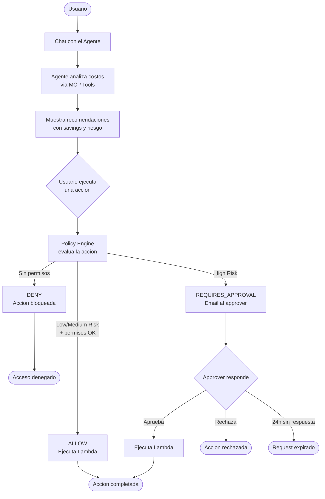
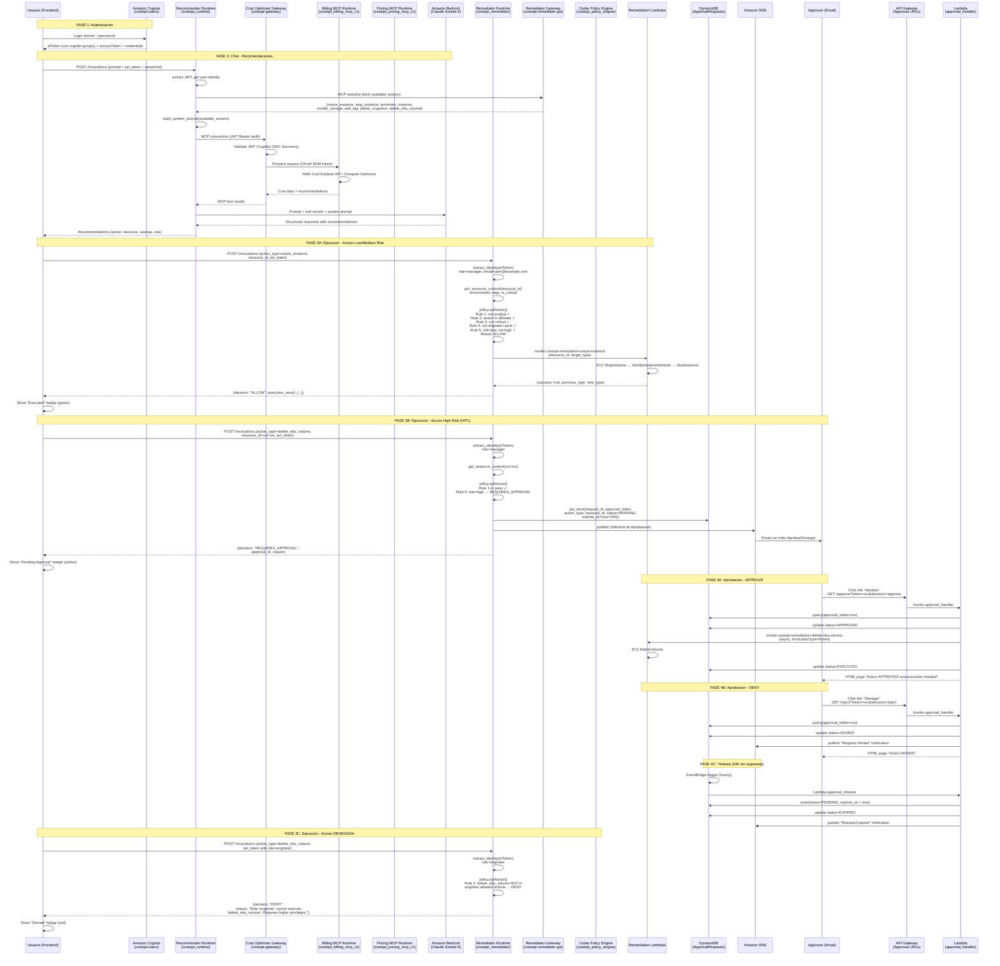
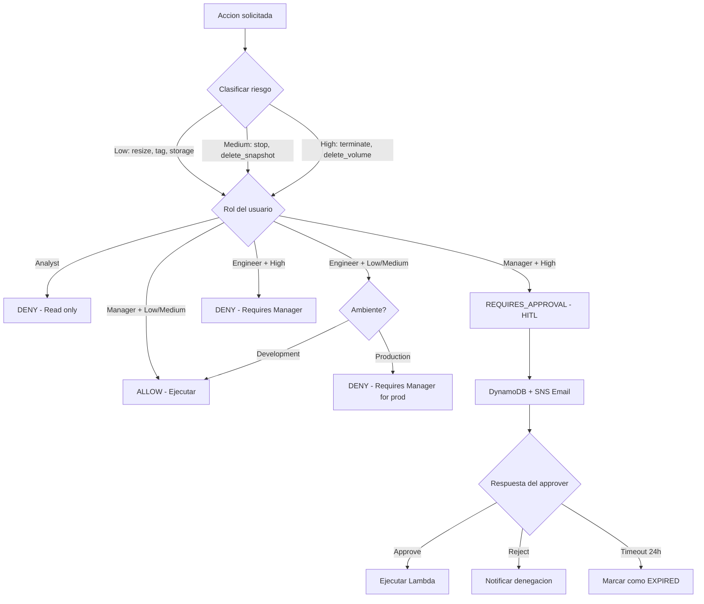
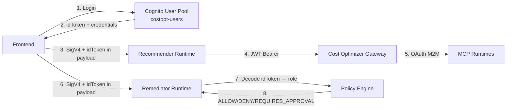

# AgentCore Cost Optimizer - Flujo Completo

## Flujo Simplificado

## Diagrama de Secuencia End-to-End

## Componentes del Sistema

### Runtimes (AgentCore)

| Runtime | Funcion | Modelo |
|---------|---------|--------|
| `costopt_runtime` | Agente recomendador (chat) | Claude Sonnet 4 |
| `costopt_remediator` | Agente ejecutor (acciones) | Claude Sonnet 4 |
| `costopt_billing_mcp_v1` | MCP Server - Cost Explorer, Compute Optimizer | N/A (tools) |
| `costopt_pricing_mcp_v1` | MCP Server - Pricing API | N/A (tools) |

### Gateways (AgentCore)

| Gateway | Targets | Auth | Policy Engine |
|---------|---------|------|---------------|
| `costopt-gateway` | billingMcp, pricingMcp | Custom JWT (Cognito) | No |
| `costopt-remediator-gw` | resize, stop, terminate, storage, tag, snapshot, volume | Custom JWT (Cognito) | Cedar (costopt_policy_engine) |

### Lambdas de Remediacion

| Lambda | Accion | Riesgo |
|--------|--------|--------|
| `costopt-remediation-resize-instance` | Resize EC2 | Low |
| `costopt-remediation-add-tag` | Add tag | Low |
| `costopt-remediation-modify-storage` | Modify EBS type/size | Low |
| `costopt-remediation-stop-instance` | Stop EC2 | Medium |
| `costopt-remediation-delete-snapshot` | Delete EBS snapshot | Medium |
| `costopt-remediation-terminate-instance` | Terminate EC2 | High |
| `costopt-remediation-delete-ebs-volume` | Delete EBS volume | High |

### Lambdas de Aprobacion

| Lambda | Trigger | Funcion |
|--------|---------|---------|
| `approval_handler` | API Gateway (GET) | Procesa approve/reject desde links en email |
| `approval_timeout` | EventBridge (hourly) | Expira requests PENDING > 24h |

### Clasificacion de Riesgo y Permisos

### Flujo de Autenticacion

